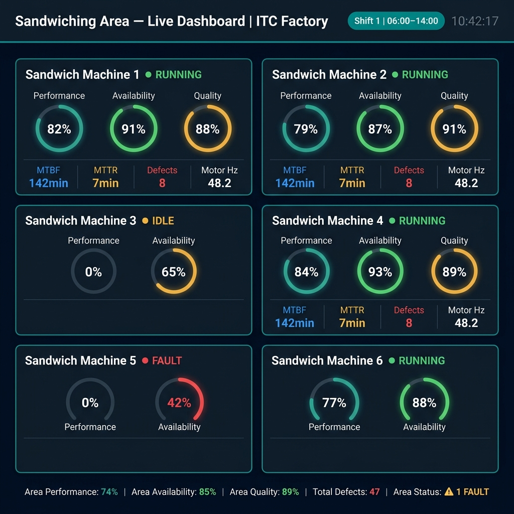

# Siemens Industrial Edge — Factory Monitoring Demo
**Food Manufacturing Plant | Siemens NanoPC | Performance Insight Dashboards**

> Demo videos are explained in Malayalam (മലയാളം). If you're not familiar with the language, I've tried to cover everything in writing below so you can still follow along.

---

## Demo Videos

I recorded two walkthroughs of the actual setup running on the NanoPC Edge device at the factory.

- **Edge Device Overview** — covers the full setup, IIH configuration, and live dashboard in action → [Watch on Google Drive](https://drive.google.com/file/d/1nTguxV_Xt7d1oeRs15mWZ_UhWgTL_qnz/view?usp=drive_link)
- **Basic Introduction & Tutorial** — goes through Edge Hub, Edge Management, and how Flow Creator fits into the picture → [Watch on Google Drive](https://drive.google.com/file/d/1gTuwk1IPGqDVvinVRqKRbb5JOEmxn--a/view?usp=drive_link)

---

## Dashboard Preview



This is the Sandwiching Area overview dashboard running live on the Edge device. Each card represents one machine with its real-time OEE gauges and motor data.

---

## What's an Edge Device and why does it matter here?

A Siemens Industrial Edge device is basically a small industrial PC that sits on the shop floor, talks directly to the PLCs, and runs a set of apps locally. The whole point is that you don't need to send everything to the cloud just to see a live dashboard — the device handles data collection, KPI computation, and visualization all by itself.

In this project we used the **Siemens NanoPC** — it's compact, fits in a panel, and runs the full Edge software stack. The factory has multiple types of PLCs (Allen Bradley Micro850, Omron NX1P2, Omron NJ501, Schneider M241, Siemens S7-1200), and the Edge device pulls data from all of them using OPC UA and other protocols.

Here's the rough data flow:

```
Field Level (PLCs)          Edge Level (NanoPC)              View
─────────────────     ──────────────────────────────     ──────────────
Micro850 PLC    ──┐
Omron NX1P2    ──┤──► IIH Essentials (stores data)
Omron NJ501    ──┤──► Flow Creator  (calculates KPIs) ──► Performance Insight
Schneider M241 ──┤──► Performance Insight (dashboards)     (browser-based)
S7-1200 PLC    ──┘
```

---

## System Architecture

```
┌─────────────────────────────────────────────────────────┐
│                  SIEMENS INDUSTRIAL EDGE                │
│                   (NanoPC Hardware)                     │
│                                                         │
│  ┌──────────────┐  ┌──────────────┐  ┌──────────────┐  │
│  │     IIH      │  │   Flow       │  │ Performance  │  │
│  │  Essentials  │◄─│  Creator     │  │   Insight    │  │
│  │  (Data Store)│  │  (Node-RED)  │  │ (Dashboards) │  │
│  └──────────────┘  └──────────────┘  └──────────────┘  │
│         ▲                  ▲                  ▲         │
│         └──────────────────┴──────────────────┘         │
│                      Edge Runtime                       │
└────────────────────────┬────────────────────────────────┘
                         │  OPC UA / S7 / Modbus TCP
              ┌──────────┴──────────┐
              │    Factory Floor    │
              │  PLCs & Machines    │
              └─────────────────────┘
```

---

## Edge Hub

When you open `https://<device-ip>` on a browser inside the local network, you land on the Edge Hub — the device's own management interface. From here you can see which apps are installed and running, check system resource usage (CPU/RAM/storage), and look at logs if something's not working. It's pretty straightforward to use. You can also restart apps or install new ones from here if you have the package file.

---

## Edge Management

Edge Management is the platform you use to manage the Edge device remotely — or if you have multiple devices across multiple plants, to manage all of them from a single place. You can push app updates, onboard new devices, monitor device health, and manage certificates from here. Think of it like a central control panel for your fleet of Edge devices. In this demo we used it to install IIH Essentials, Flow Creator, and Performance Insight onto the NanoPC.

---

## IIH Essentials (Industrial Information Hub)

IIH is where all the data lives on the device. It's a time-series datastore that runs as a container on the Edge. You define an **asset model** — basically a tree structure that mirrors your factory hierarchy — and under each asset you create variables that hold the actual data values. IIH then connects to the PLC connectors and keeps these variables updated in real time.

The asset tree we built for this factory looks like this:

```
Factory (Root)
├── Sandwiching Area
│   ├── Sandwich Machine 1  (Micro850 PLC)
│   ├── Sandwich Machine 2  (Micro850 PLC)
│   ├── Sandwich Machine 3  (Micro850 PLC)
│   ├── Sandwich Machine 4  (Micro850 PLC)
│   ├── Sandwich Machine 5  (Micro850 PLC)
│   └── Sandwich Machine 6  (Micro850 PLC)
├── Primary Packing
│   └── Primary Machine 1 to 5  (Omron NX1P2)
├── Secondary Packing
│   └── Secondary Machine 1, 2  (Omron NJ501)
├── Tertiary Packing
│   └── Tertiary Machine 1, 2  (PCB + Delta HMI)
├── Cooling Tunnel
│   └── Cooling Machine 1  (Schneider M241)
├── Grinding Area
│   └── Grinding Machine 1  (S7-1200 PLC)
└── Tapping Machine
    └── Tapping Machine 1
```

Variable names follow a consistent pattern: `<AreaCode>_<MachineCode>_<VariableName>`. For example, everything under Sandwich Machine 1 starts with `SW_M1_`:

| Variable | Type | What it holds |
|---|---|---|
| `SW_M1_Performance` | Float % | Performance OEE component |
| `SW_M1_Availability` | Float % | Availability OEE component |
| `SW_M1_Quality` | Float % | Quality OEE component |
| `SW_M1_MTBF` | Int (min) | Mean time between failures |
| `SW_M1_MTTR` | Int (min) | Mean time to repair |
| `SW_M1_Status` | String | "Running" / "Fault" / "Idle" |
| `SW_M1_Motor1_Speed` | Float Hz | VFD motor speed |
| `SW_M1_Motor1_Current` | Float A | Motor current draw |

---

## Flow Creator (Node-RED)

Flow Creator is essentially Node-RED running as a Siemens Edge app. This is where all the calculation logic lives — it reads raw PLC values from IIH, computes things like OEE, MTBF, MTTR, and then writes the results back into IIH so the dashboards can display them.

We have four main flows running:

**Shift Manager** — runs every minute, checks the current time, and writes the active shift name to IIH so dashboards can display it.
```javascript
const h = new Date().getHours();
let shift;
if (h >= 6 && h < 14)       shift = "Shift 1 | 06:00–14:00";
else if (h >= 14 && h < 22) shift = "Shift 2 | 14:00–22:00";
else                         shift = "Shift 3 | 22:00–06:00";
```

**OEE Calculator** — runs every 30 seconds per machine, takes the raw production counts and calculates the three OEE pillars plus MTBF and MTTR.
```javascript
const availability = ((plannedTime - totalDT) / plannedTime) * 100;
const performance  = (goodCount / totalProd) * 100;
const quality      = (goodCount / totalProd) * 100;
const oee          = (availability / 100) * (performance / 100) * (quality / 100) * 100;
const mtbf         = (plannedTime - totalDT) / failCount;
const mttr         = faultDT / failCount;
```

**Area Aggregator** — runs every 60 seconds, rolls up the six machine values into a single area-level KPI for each zone. Area status becomes "Fault" if any machine is faulted, "Idle" if any is idle but none faulted, otherwise "Running".
```javascript
SW_Area_Performance = avg(SW_M1..6_Performance)
SW_Area_Defects     = sum(SW_M1..6_Defects)
SW_Area_Status      = anyFault ? "Fault" : anyIdle ? "Idle" : "Running"
```

**Shift Reset** — triggers at 06:00, 14:00, and 22:00 to zero out all counters (production counts, defects, downtime) so each shift starts fresh.

The flow JSON files are included in this repo — see `NodeRED_Flow_Updated.json`. To import them, open Flow Creator on the device, go to Menu → Import, paste the JSON, and hit Deploy.

---

## Performance Insight (Dashboards)

Performance Insight is the dashboard application running on the Edge — no external BI tool needed. It reads directly from IIH variables and renders real-time widgets. We built dashboards at two levels: area-level overviews and per-machine detail pages.

The factory is organized into 8 dashboard levels:

| Dashboard | What it shows |
|---|---|
| Factory Overview | KPI summary for all 7 areas with drill-down |
| Sandwiching Area | 6 machines — OEE gauges + area rollups |
| Sandwich Machine (per machine) | Motor data, OEE, fault history |
| Primary Packing Area | 5 machines + over/underweight counts |
| Secondary / Tertiary Packing | CFC counts, MTBF/MTTR |
| Cooling Tunnel | Temperature, frequency, motor current |
| Grinding Area | Motor, temperature, humidity |
| Tapping Machine | SKU-wise CFC breakdown |

Color thresholds are consistent across all dashboards:

| KPI | Green (Good) | Amber (Warning) | Red (Critical) |
|---|---|---|---|
| Performance | ≥ 75% | 50–74% | < 50% |
| Availability | ≥ 80% | 60–79% | < 60% |
| Quality | ≥ 90% | 80–89% | < 80% |
| MTBF | ≥ 120 min | 60–119 min | < 60 min |
| MTTR | ≤ 10 min | 11–20 min | > 20 min |

Shifts are configured under Performance Insight Settings → Time Configuration:

| Shift | Start | End |
|---|---|---|
| Shift 1 | 06:00 | 14:00 |
| Shift 2 | 14:00 | 22:00 |
| Shift 3 | 22:00 | 06:00 (next day) |

All dashboard JSON files are included in the repo and ready to import. Just go to Performance Insight → Dashboards → Import and select the file for the corresponding asset.

---

## Files in this Repo

```
siemens-edge-demo/
├── README.md
├── dashboard_preview.png
├── NodeRED_Flow_Updated.json          ← main Flow Creator flows
├── Get_UUIDs_Flow.json                ← helper to fetch IIH asset UUIDs
├── Advanced_M1_Dashboard.json         ← Performance Insight dashboard
├── Sandwich Machine 1 — Detail Dashboards1.json
├── Sandwich Machine 2 — Detail Dashboards.json
├── Aesthetic_Dashboards/              ← polished versions for all 6 machines
│   ├── Aesthetic_SW_Machine_1_Dashboard.json
│   ├── Aesthetic_SW_Machine_2_Dashboard.json
│   └── ...
├── PI_Dashboard_Templates/            ← full template reference library
│   ├── 00_MASTER_REFERENCE.md
│   ├── 01_Factory_Overview.md
│   └── ... (13 templates total)
└── iih-essentials-backup-config.json  ← full IIH backup (asset tree + variables)
```

---

## How to Set This Up on Your Own Edge Device

You'll need a Siemens Industrial Edge device with IIH Essentials (v1.8+), Flow Creator (v1.16+), and Performance Insight (v2.0+) installed from Edge Management.

**Step 1 — Restore the IIH backup**
Go to IIH Essentials → Settings → Backup/Restore, upload `iih-essentials-backup-config.json`. This brings back the full asset tree and all variable definitions in one shot.

**Step 2 — Import the flows**
Open Flow Creator, go to Menu → Import, paste the contents of `NodeRED_Flow_Updated.json`, then Deploy. The flows will start running immediately.

**Step 3 — Import the dashboards**
In Performance Insight, navigate to the target asset (e.g. Sandwiching Area → Machine 1), then Dashboards → Import and pick the matching JSON file. Variable mapping usually auto-completes — if not, refer to `14_Complete_Variable_Mapping.md` in the templates folder.

**Step 4 — Check that data is flowing**
Open IIH Essentials → Data Explorer and confirm the variables are getting values. Then open the dashboards — the KPI widgets should be live and color-coded within a minute or two of the flows running.

> One thing to watch: the dashboard JSON files use UUIDs from the original IIH setup. If you're starting fresh (not restoring from the backup), the UUIDs will be different. Use `Get_UUIDs_Flow.json` to pull the correct UUIDs from your IIH instance and update the dashboard JSON files before importing.

---

## References

- [Siemens Industrial Edge Documentation](https://support.industry.siemens.com/cs/document/109773389)
- [Industrial Edge Marketplace](https://www.siemens.com/industrial-edge)
- [Node-RED Docs](https://nodered.org/docs/)
- [Performance Insight App Guide](https://support.industry.siemens.com)
